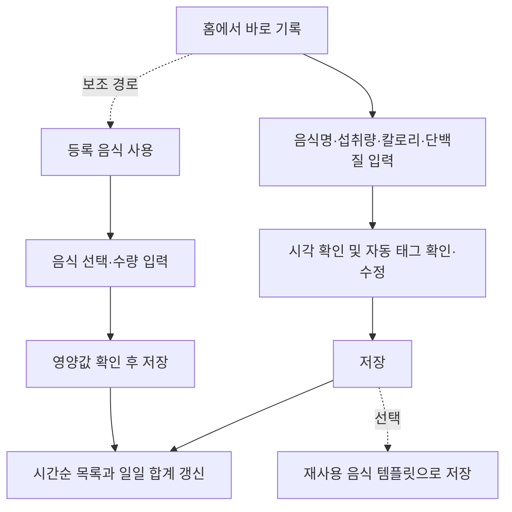

# meal-tracker 제품 요구사항 문서 (PRD)

- **문서 상태:** 기획 초안
- **제품명:** meal-tracker
- **대상:** 모바일 중심 개인 식단 관리 앱
- **범위:** 칼로리·단백질 기록 및 일일 목표 확인
- **기준 원칙:** 아직 결정되지 않은 정책과 기술 선택은 본문에서 제안 또는 미결정으로 표시한다.

## 1. 프로젝트 개요

### 1.1 제품 정의

meal-tracker는 음식 템플릿이 없어도 음식명과 이번 섭취분 영양값을 입력해 날짜별 식단을 바로 기록하고, 하루 칼로리·단백질 섭취량을 목표와 비교해 확인하는 간결한 앱이다. 자주 먹는 음식은 선택적으로 템플릿에 저장해 재사용할 수 있다.

### 1.2 문제와 제품 목표

| 항목 | 정의 |
|---|---|
| 해결하려는 문제 | 식사마다 칼로리·단백질을 반복 입력하는 부담과 하루 목표 달성 여부를 확인하기 어려운 문제 |
| 제품 목표 | 적은 조작으로 음식 섭취를 기록하고 오늘의 합계와 목표 대비 차이를 명확히 보여 준다. |
| 성공 기준(제안) | 등록된 음식이 없어도 음식명과 섭취 영양값을 입력해 즉시 기록할 수 있고, 날짜별 섭취량과 목표 현황이 일관되게 표시된다. 정량 지표와 목표치는 사용성 검증 후 결정한다. |
| 범위 경계 | 칼로리와 단백질만 관리한다. 음식 기본 DB, 운동, 식단 추천, 추가 영양소 분석은 다루지 않는다. |

### 1.3 전제

- 초기 사용자는 한 명이며, 향후 공개 가능성은 고려하되 다중 사용자 서비스의 세부 운영 정책은 확정하지 않는다.
- 초기 UX 검증은 HTML/CSS/JavaScript 프로토타입과 임시 데이터 또는 localStorage를 사용할 수 있다.
- 최종 플랫폼, 백엔드, 데이터베이스, OCR 기술은 미정이다.

## 2. 제품 비전 및 핵심 설계 원칙

**비전:** “Simple is Best” — 먹은 음식을 빠르게 남기고, 칼로리와 단백질 목표를 한눈에 파악한다.

1. **필요한 정보만 표시:** 칼로리, 단백질, 기록 항목과 목표 현황에 집중한다.
2. **기록 경로 단축:** 음식 템플릿 등록 없이도 바로 기록한다. 템플릿은 반복 입력을 줄이는 보조 기능이다.
3. **처음부터 설명 없이 사용:** 홈에서 기록과 현황을 알아볼 수 있게 하고, 복잡한 튜토리얼은 두지 않는다.
4. **사용자 음식만 관리:** 앱 제공 음식 DB를 두지 않는다. 사용자가 직접 기록한 내용과 선택적으로 저장한 템플릿만 사용한다.
5. **모바일 우선:** 세로 화면과 한 손 조작을 기준으로 핵심 동작을 배치한다.
6. **바로 기록 우선:** 등록된 음식이 없어도 매번 직접 입력해 기록할 수 있다. 재사용 음식 등록은 반복 입력을 줄이는 보조 기능이다.
7. **영양 정보의 출처와 시점 보존:** 음식 템플릿을 나중에 수정해도 이미 저장한 기록은 바뀌지 않는다.
8. **제안과 사실을 구분:** 목표 계산은 추정치이며, 사용자가 수정한 값이 실제 적용 목표다.

## 3. 타깃 사용자 및 주요 사용 시나리오

### 3.1 타깃 사용자

- 매일 먹은 음식의 칼로리와 단백질만 간단히 관리하려는 개인 사용자
- 자주 먹는 음식이 반복되어 직접 등록 후 재사용하고 싶은 사용자
- 복잡한 영양 분석이나 식단 추천보다 목표 대비 현재 수치를 확인하고 싶은 사용자

### 3.2 핵심 사용 시나리오

| 사용자 목적 | 주요 경로 | 기대 결과 |
|---|---|---|
| 앱을 처음 설정한다 | 설정 시작 → 신체 정보 입력 → 추천 목표 확인·수정 → 저장 | 적용할 칼로리·단백질 목표가 설정된다. |
| 등록 음식 없이 바로 기록한다 | 홈 바로 기록 → 음식명·섭취량·칼로리·단백질 입력 → 저장 | 해당 음식이 오늘 기록에 바로 추가된다. 템플릿으로 저장할지는 선택 사항이다. |
| 자주 먹는 음식을 재사용한다 | 바로 기록 폼 또는 설정 → 음식 템플릿 저장 → 다음 기록에서 선택 | 다음부터 템플릿으로 입력을 줄일 수 있다. |
| 성분표에서 수치를 가져온다 | 템플릿 등록/수정 → OCR 촬영 → 성분표 표기 기준과 템플릿 단위당 수치 확인·수정 → 저장 | 확인된 단위당 칼로리·단백질만 템플릿에 반영된다. |
| 등록 음식을 먹었다 | 홈 등록 음식 사용 → 음식 검색·선택 → 수량·시간·태그 확인 → 추가 | 시간순 기록과 일일 합계가 갱신된다. |
| 과거 기록을 고친다 | 달력에서 날짜 선택 → 시간순 기록 항목 수정 | 선택 날짜의 기록과 합계가 갱신된다. |
| 기존 음식 정보를 고친다 | 설정 → 음식 관리 → 음식 선택 → 수정 | 이후 기록에 새 정보가 사용되고 과거 기록은 유지된다. |

## 4. 핵심 기능 명세

우선순위: **P0 필수**, **P1 선택**, **P2 추후 검토**, **제외**.

| 기능 | 요구사항 | 우선순위 |
|---|---|---|
| 일일 목표 | 칼로리·단백질 목표 직접 입력 및 수정 | P0 |
| 목표 추천 계산 | 신체 정보 및 목표 방향을 이용해 추정치를 제안하고 사용자가 확인·수정 | P1 (수식·입력 필수 여부 의사결정 필요) |
| 음식 템플릿 등록·수정·삭제 | 자주 먹는 음식의 이름, 단위, 단위당 칼로리·단백질을 재사용용으로 관리. 등록 시 수량은 입력하지 않음 | P1 |
| 음식 검색·재사용 | 저장된 템플릿을 검색하고 기록에 적용 | P1 |
| 바로 식단 기록 | 템플릿 없이 음식명, 실제 섭취량·단위, 해당 섭취분의 칼로리·단백질을 입력해 즉시 기록. 기록 시각 자동 입력 및 수정 가능 | P0 |
| 기록 태그 | 먹은 시간에 따라 아침·점심·저녁·간식 태그를 기본 선택. 사용자가 변경하거나 태그 없음을 선택 가능 | P0 |
| 기록 시간순 목록 | 날짜의 기록을 섭취 시각 오름차순으로 한 목록에 표시하고 추가·삭제·수정 | P0 |
| 재사용 음식 템플릿 | 음식 등록·검색·수정·삭제. 직접 기록 중 템플릿 저장을 선택할 수 있음 | P1 |
| 영양 스냅샷 | 기록 시점 영양값을 항목에 저장해 템플릿 수정 후에도 과거 합계를 보존 | P0 |
| 오늘 현황 | 칼로리·단백질 섭취량, 목표, 진행률, 남은 칼로리·부족 단백질 표시 | P0 |
| 날짜 이동·과거 편집 | 달력에서 날짜를 선택해 조회 및 수정 | P0 |
| 달성 상태 | 날짜별 칼로리·단백질 목표 결과를 구분해 달력에 표시 | P0, 판정 정책 미결정 |
| 영양성분표 OCR | 보조 음식 템플릿 등록/수정에서 칼로리·단백질 수치를 제안하고 성분표 기준과 템플릿 단위를 확인 후 적용 | P2 (기술·개인정보 검토 필요) |
| 계정·동기화·공유 | 현재 요구사항에서 세부 범위 미정 | P2 |
| 제외 기능 | AI 식단 추천, 사진 칼로리 추정, 기본 음식 DB, 식사 조합 프리셋, 운동, 탄수화물·지방 추적, 커뮤니티·소셜, 배달 추천, 복잡한 통계 | 제외 |

### 4.1 목표 설정 및 추천 계산

#### 입력 항목

| 항목 | 형식 | 용도 |
|---|---|---|
| 성별 | 선택 | Mifflin–St Jeor 공식의 상수 선택에 사용. 입력 정책은 아래 미결정 참조. |
| 나이 | 정수(년) | 기초대사량 추정 |
| 신장 | 숫자(cm) | 기초대사량 추정 |
| 체중 | 숫자(kg) | 기초대사량·단백질 추정 |
| 활동량 | 단계 선택 | 총 일일 에너지 소비량(TDEE) 추정 |
| 목표 | 감량·유지·증량 | 권장 칼로리 조정 방향 |
| 목표 칼로리·단백질 | 숫자 | 적용 목표. 사용자가 직접 조정 가능 |

#### 추천 계산식(기획 제안, 확정 전 검토 필요)

1. **기초대사량(BMR):** Mifflin–St Jeor 추정식을 제안한다.
   - 남성 계수: `10 × 체중(kg) + 6.25 × 신장(cm) − 5 × 나이(년) + 5`
   - 여성 계수: `10 × 체중(kg) + 6.25 × 신장(cm) − 5 × 나이(년) − 161`
2. **유지 칼로리(TDEE):** BMR에 활동계수를 곱한다. 초기 후보는 낮음 1.2, 가벼움 1.375, 보통 1.55, 높음 1.725, 매우 높음 1.9이다. 활동 단계의 설명과 수치는 검증 후 확정한다.
3. **목표 칼로리:** 유지 = TDEE, 감량 = TDEE의 85%, 증량 = TDEE의 110%를 초기 후보로 제안한다. 안전 하한/상한을 임의 확정하지 않으며 별도 검토한다.
4. **단백질:** 초기 제안값은 체중(kg) × 1.6g/일이다. 사용자가 직접 설정할 수 있어야 한다. 목표별 배수 차등 적용은 근거와 UX 검토 전에는 확정하지 않는다.
5. 계산 결과는 추천값일 뿐이다. 앱이 의료적 처방처럼 표현하거나 사용자의 수동 입력을 덮어쓰지 않는다. 계산 결과가 반올림되는 자릿수와 허용 입력 범위는 구현 전 확정한다.

#### 최초 설정 및 목표 수정 UX

- 첫 진입 시 설정 화면 또는 간결한 단계형 시트를 제공한다. 먼저 칼로리·단백질 직접 입력을 허용하고, 추천 계산을 원하면 신체 정보를 입력하게 한다.
- 계산 버튼/단계 실행 후 추천 칼로리와 단백질을 한 화면에서 확인한다. 각 값은 저장 전 편집할 수 있다.
- 저장 후 홈에 적용 목표를 표시한다. 추천값과 실제 목표를 별도로 저장하거나 보여줄 필요가 있는지는 미결정이다. 최소 UX에서는 적용 목표만 유지한다.
- 설정에서 목표를 다시 계산하거나 직접 수정할 수 있다. 재계산은 현재 목표를 자동 덮어쓰지 않고 변경 전·후 값을 확인한 뒤 저장한다.
- 목표 변경의 과거 달력 판정 영향은 별도 정책으로 확정한다. 데이터 모델 제안은 8장 참조.

### 4.2 바로 기록 및 음식 태그

- 템플릿 선택을 요구하지 않는다. 홈의 **바로 기록** 동작에서 음식명, 실제 먹은 양과 단위, 해당 섭취분의 칼로리·단백질을 입력하면 기록을 저장할 수 있다.
- 영양값은 템플릿 기준량 계산값이 아니라 지금 먹은 분량의 총값으로 입력한다. 화면에 “이번에 먹은 양 기준”임을 명시한다.
- 섭취 시각은 현재 시각을 기본값으로 자동 입력하고 사용자가 변경할 수 있다. 같은 날짜의 목록은 섭취 시각 오름차순으로 정렬한다. 같은 시각이면 먼저 저장한 항목을 앞에 둔다.
- 태그는 먹은 시간으로 기본 선택한다. 초기 제안 시간대는 아침 05:00–10:59, 점심 11:00–15:59, 저녁 16:00–21:59, 간식 22:00–04:59다. 이 시간대는 초안이며 사용성 검토 후 확정한다.
- 사용자는 자동 선택된 태그를 직접 바꾸거나 태그 없음을 선택할 수 있다. 시간을 수정하면 태그를 직접 바꾸지 않은 경우에만 시간대에 맞춰 태그를 다시 선택한다. 직접 변경한 태그는 수동 선택으로 유지한다.
- 태그는 작은 칩 형태로 기록 옆에 표시하며, 식사를 구역으로 나누거나 기록 순서를 바꾸지 않는다.
- 태그는 식사를 별도 구역으로 나누거나 항목을 재정렬하지 않는다. 시간순 목록과 일일 합계가 기본 구조다.
- 바로 기록을 저장한 뒤 “재사용 음식으로 저장”을 선택하면 템플릿을 만든다. 현재 기록의 총 영양값을 입력한 수량으로 나눠 템플릿의 단위당 값으로 저장하며, 템플릿 등록 단계에서 별도 수량은 입력하지 않는다.

### 4.3 음식 템플릿 관리

| 필드 | 정의 | 검증·표시 |
|---|---|---|
| 음식 이름 | 사용자가 식별할 이름 | 필수, 공백만 입력 불가 |
| 단위 | 개, 스쿱, 팩, 봉지, 100g 또는 사용자 입력 단위 | 필수, 템플릿의 1단위를 사용자가 알아볼 수 있게 표시 |
| 단위당 칼로리 | 템플릿에서 정의한 1단위에 대한 kcal | 필수, 0 이상 |
| 단위당 단백질 | 템플릿에서 정의한 1단위에 대한 g | 필수, 0 이상 |
| 음식 ID·생성/수정 시각 | 관리 식별자·정렬 용도 | 시스템 관리 |

템플릿 등록·수정에서는 먹을 개수나 섭취 수량을 받지 않는다. 사용자는 단위를 정하고 그 1단위의 칼로리·단백질을 입력한다. 예를 들어 단위가 `개`면 1개당 값을, `100g`이면 100g당 값을 넣는다. 실제 기록 수량은 템플릿을 불러와 기록할 때 입력한다.

바로 기록 후 템플릿 저장을 선택한 경우에는 해당 기록의 총 영양값을 기록 수량으로 나눠 단위당 값으로 저장한다. 음식 수정은 템플릿의 이후 사용에 적용한다. 음식 삭제는 연결된 과거 식단 기록의 이름·수량·영양 스냅샷을 보존하고 템플릿만 비활성/삭제한다. 삭제 확인 문구와 복구 정책은 미결정 사항으로 남긴다.

### 4.4 기록 및 합계

- 날짜별 모든 기록을 섭취 시각순 단일 목록으로 표시한다. 같은 태그의 항목을 한 구역으로 모으지 않는다.
- 바로 기록은 섭취량과 그 분량의 칼로리·단백질을 입력받아 저장한다. 기록 수량과 단위당 영양값을 함께 보존해 수량 변경 시 총 영양값을 다시 계산할 수 있다.
- 템플릿을 사용한 기록은 `기록 수량 × 템플릿 단위당 영양값`으로 계산한다. 수량은 등록 때 입력하지 않고 템플릿을 불러와 기록할 때 입력한다.
- 항목 저장 시 음식명, 수량·단위, 섭취 시각, 선택형 태그와 칼로리·단백질 스냅샷을 저장한다. 템플릿 연결이 있어도 과거 기록 계산은 스냅샷을 기준으로 한다.
- 날짜별 합계는 태그와 관계없이 해당 날짜의 모든 기록을 더한다. 목표보다 많이 섭취해도 실제 섭취량을 그대로 표시한다. 남은 칼로리와 부족 단백질은 각각 `max(목표−섭취량, 0)`로 계산하는 것을 제안한다. 초과량 표시 여부는 미결정이다.

### 4.5 영양성분표 OCR

- 음식 신규 등록과 기존 음식 수정에서 동일하게 진입할 수 있다.
- OCR은 숫자 및 라벨 위치를 찾아 **칼로리와 단백질** 값만 제안한다. 제품 인식, 1회 섭취량 추론, g↔개 환산, 음식 자동 생성 확정은 하지 않는다.
- 결과 검토 화면에는 추출 수치와 성분표의 원본 기준량, 템플릿에 정한 단위를 구분해 보여 준다. 둘의 기준이 다르면 앱이 환산하지 않으며, 사용자가 단위당 값으로 직접 환산해 입력한다.
- 사용자가 단위와 단위당 두 영양값을 확인·수정한 후에만 음식 템플릿에 반영한다. 취소 시 OCR 결과는 저장하지 않는다.
- 촬영 실패, 권한 거부, 흐릿한 이미지, 값 누락·불확실은 오류 상태를 안내하고 동일 화면에서 직접 입력할 수 있도록 한다.
- 외부 API를 선택할 경우 API 키는 앱 클라이언트에 두지 않는다. 이미지 전송 범위, 보관·삭제, 동의, 비용, 오프라인 대체 경로를 기술 검토에서 정한다. 무료 기술 우선 검토는 요구사항이지만 특정 구현을 확정하지 않는다.

## 5. 정보 구조(IA)

```text
앱
├─ 홈 (오늘 또는 선택한 날짜)
│  ├─ 칼로리·단백질 현황
│  ├─ 시간순 식단 기록 및 선택형 태그
│  ├─ 바로 기록 (음식명·섭취량·칼로리·단백질)
│  └─ 등록 음식 재사용 / 템플릿 관리 (보조 기능)
├─ 달력
│  └─ 날짜 선택 → 해당 날짜 홈/식단 상세
└─ 설정
   ├─ 목표 칼로리·단백질
   ├─ 신체 정보·추천 계산
   └─ 등록 음식 목록·검색·수정·삭제
```

전역 하단 내비게이션은 홈·달력·설정 세 항목만 둔다. 음식 추가, 음식 편집, OCR은 맥락에 따라 화면 또는 모달로 진입한다.

## 6. 화면별 구성 및 요구사항

### 6.1 홈

| 영역 | 구성·동작 |
|---|---|
| 날짜 헤더 | 오늘 날짜를 기본 표시. 달력에서 과거 날짜를 선택해 진입한 경우 해당 날짜를 표시하고 날짜 이동 경로를 제공한다. 직접 좌우 스와이프 날짜 이동은 선택 사항이다. |
| 일일 현황 | 칼로리 `섭취 / 목표 kcal`, 단백질 `섭취 / 목표 g`, 진행 바, 남은 칼로리·부족 단백질을 표시한다. 초과 시 진행 바 상한 처리와 초과량 표현은 미결정이다. |
| 기록 목록 | 날짜별 모든 항목을 섭취 시간순으로 나열한다. 이름, 섭취량·단위, 칼로리·단백질, 선택 태그를 표시한다. 태그로 섹션을 나누지 않는다. |
| 바로 기록 | 항상 접근 가능한 주요 동작. 음식명·섭취량·단위·이번 섭취분 칼로리·단백질을 입력해 저장한다. 템플릿이 없어도 완결된다. |
| 홈 입력 버튼 | **바로 기록**과 **등록 음식 불러오기** 버튼을 좌우로 나란히 둔다. 바로 기록이 주요 동작이며, 불러오기는 색상으로 구분된 보조 버튼으로 표시한다. |
| 등록 음식 사용 | 보조 동작으로 등록된 템플릿 검색·선택 후 먹은 수량과 시각을 입력해 추가한다. |
| 빈 상태 | 기록이 없으면 “아직 기록이 없어요”와 바로 기록 버튼을 보여 준다. 템플릿 등록을 먼저 요구하지 않는다. |
| 기록 태그 | 먹은 시간에 따른 태그가 기본 선택된다. 사용자는 태그를 바꾸거나 해제할 수 있다. |
| 기록 변경 | 항목에서 수량·영양정보·시간·태그 변경 또는 삭제를 제공한다. 과거 날짜도 동일하게 편집한다. |

### 6.2 달력

- 월별 달력과 이전/다음 달 이동을 제공한다.
- 날짜 셀에는 기록 상태를 색상만으로 의존하지 않도록 텍스트/기호 등 보조 신호를 함께 쓸 수 있다. 기호 체계는 디자인 단계에서 단순하게 확정한다.
- 상태 종류와 제안 표현:

| 상태 | 달력 의미 |
|---|---|
| 두 목표 달성 | 칼로리 조건 및 단백질 조건 모두 충족 |
| 칼로리만 달성 | 칼로리 조건만 충족 |
| 단백질만 달성 | 단백질 조건만 충족 |
| 모두 미달성 | 기록은 있으나 어느 목표 조건도 충족하지 않음 |
| 기록 없음 | 저장된 식단 항목 없음 |
| 오늘 진행 중(제안) | 오늘은 아직 진행 중이며 최종 판정을 하지 않음. 기존 5개 상태와 별도의 미완료 표현으로 제안 |

- 날짜 탭 시 해당 날짜의 홈/식단 상세를 연다. 미래 날짜 선택을 허용할지는 미결정이다.
- 당일은 사용자가 하루를 마치기 전 값이 바뀔 수 있으므로, ‘진행 중’ 표기를 추천한다. 일일 마감 시각/시간대 처리 정책은 미결정이다.

### 6.3 설정

- **목표:** 적용 중인 칼로리·단백질 목표와 편집 동작.
- **신체 정보:** 성별·나이·신장·체중·활동량·목표 방향 및 추천 재계산.
- **음식 관리:** 등록 음식 검색, 편집, 삭제. 목록에서 이름과 단위당 영양값을 확인한다. 템플릿 등록 화면에는 수량 필드가 없다.
- 계정, 알림, 테마 등 요구에 없는 설정은 추가하지 않는다.

### 6.4 바로 기록 및 등록 음식 사용 화면/모달

1. 기본 경로는 **바로 기록**이다. 음식 이름, 이번에 먹은 양·단위, 이번 섭취분 칼로리·단백질과 시각을 입력한다.
2. 선택형 태그(아침·점심·저녁·간식)를 붙이거나 태그 없이 저장한다.
3. 저장 후 기록을 시간순 목록에 추가하고 홈의 일일 합계를 갱신한다.
4. 등록 음식 사용은 보조 경로다. 템플릿을 검색·선택하고 수량을 지정하면 영양값을 계산해 미리보기한다.
5. 템플릿이 비어 있어도 바로 기록 폼을 그대로 사용할 수 있다. 바로 기록 후 재사용 템플릿 저장을 선택할 수 있다.

## 7. 사용자 흐름(User Flow)

### 7.1 시나리오 흐름

| # | 진입 | 행동 및 화면 전환 | 입력 데이터 | 완료 상태 | 예외 상황 |
|---|---|---|---|---|---|
| 1. 최초 실행·목표 설정 | 앱 첫 실행 → 홈/목표 설정 | 목표 직접 입력 또는 신체 정보 입력 → 추천 결과 확인·수정 → 저장 → 홈 | 성별, 나이, 신장, 체중, 활동량, 목표 방향, 적용 칼로리·단백질 | 저장된 목표로 홈 현황을 계산 | 선택 입력 누락, 범위 오류, 추천 계산 불가이면 직접 목표 입력을 허용하고 원인을 안내 |
| 2. 처음 먹는 음식 기록 | 홈의 바로 기록 | 음식명·이번 섭취량·단위·총 칼로리·단백질 입력 → 시각과 자동 태그 확인·수정 → 선택적으로 템플릿 저장 → 저장 | 이름, 섭취량·단위, 섭취분 영양값, 시각, 태그 | 식단 항목이 즉시 저장됨. 템플릿 저장은 선택 | 이름/영양값 누락 및 잘못된 수량을 필드 근처에 안내. OCR은 선택 보조 수단 |
| 3. OCR을 이용한 템플릿 등록 | 설정의 음식 관리 → 음식 등록/수정 → 성분표 촬영 | 촬영 → 추출값과 성분표 기준 검토 → 템플릿 기록 단위당 값으로 직접 확인·수정 → 저장 | 이미지, 추출 칼로리·단백질, 성분표 표기 기준, 사용자 단위 | 사용자 확인값으로 재사용 템플릿 저장 | 권한 거부·촬영 실패·값 누락·불확실 시 수동 입력 화면으로 복귀. 바로 기록은 OCR 없이도 가능 |
| 4. 등록 음식으로 기록 | 홈 → 등록 음식 불러오기 버튼 | 검색/선택 → 먹은 수량 입력 → 섭취시각과 시간 기반 태그 확인·수정 → 영양 미리보기 → 추가 | 음식 ID, 날짜, 수량, 시각, 태그 | 시간순 목록과 홈 합계 갱신 | 음식이 삭제/비활성화된 경우 목록에서 제외. 직접 기록 경로는 계속 사용 가능 |
| 5. 기록 수정 | 시간순 기록 항목 또는 달력에서 과거 날짜 진입 | 항목 편집 → 수량·영양값·시각·태그 변경 또는 삭제 → 저장 | 식단 항목 ID와 변경 필드 | 해당 날짜 목록 및 일일 합계 갱신 | 저장 실패 시 기존 값 유지, 재시도 가능. 삭제 확인 필요 여부 미결정 |
| 6. 과거 달성 현황 확인 | 달력 탭 | 월 이동 → 날짜 상태 확인 → 날짜 선택 → 식단 조회·수정 | 월, 날짜 | 해당 날짜 기록 조회 | 기록 없음과 0 섭취를 구분. 당일은 진행 중 표현 제안 |
| 7. 기존 음식 수정 | 설정 → 음식 관리 | 검색 → 음식 선택 → 필드 또는 OCR 수정 → 확인·저장 | 음식 ID, 변경 필드 | 템플릿 갱신, 이후 기록에 적용 | OCR 취소·실패 시 기존 값 유지. 이전 식단 스냅샷은 유지 |

### 7.2 최소 터치 기록 흐름



## 8. 데이터 모델

제품·저장 기술은 지정하지 않는다. 아래는 개념 모델이며 날짜·시간은 로컬 시간대 표시와 저장 방식을 기술 설계에서 정한다.

| 모델 | 역할 | 주요 필드(타입 / 필수) | 관계·규칙 |
|---|---|---|---|
| 사용자(User) | 사용자 프로필 식별 | `id` 문자열/UUID(필수), `createdAt` 날짜시간(필수), `timezone` 문자열(선택/추후 확정) | 1명의 사용자가 신체정보, 목표, 음식과 기록을 소유한다. 로컬 단일 사용자 구현에서 명시 사용자 엔티티가 필요할지는 구현 시 단순화 가능 |
| 신체 정보(Profile) | 추천 계산에 필요한 현재 입력값 | `userId` ID(필수), `sex` 열거형(계산 가능 값 정책 미결정), `ageYears` 정수(선택), `heightCm` 숫자(선택), `weightKg` 숫자(선택), `activityLevel` 열거형(선택), `updatedAt` 날짜시간(필수) | 사용자 1:1 현재값. 재계산 시점 기록 보존 필요 여부 미결정 |
| 사용자 목표(Goal) | 실제 적용 칼로리·단백질 목표 및 목표 설정 이력 | `id` ID(필수), `userId` ID(필수), `caloriesKcal` 숫자(필수), `proteinG` 숫자(필수), `goalType` 감량/유지/증량(선택), `source` 추천/수동(선택), `effectiveFrom` 날짜(필수), `effectiveTo` 날짜(선택), `createdAt` 날짜시간(필수) | 사용자 1:N 이력 제안. 적용 목표 하나는 각 날짜의 평가 기준으로 사용한다. 과거 판정 기준 보존은 정책 결정 필요 |
| 등록 음식(Food) | 재사용 가능한 사용자 음식 템플릿 | `id` ID(필수), `userId` ID(필수), `name` 문자열(필수), `unit` 문자열(필수), `caloriesPerUnitKcal` 숫자(필수), `proteinPerUnitG` 숫자(필수), `isArchived` 불리언(제안), `createdAt`/`updatedAt` 날짜시간(필수) | 사용자 1:N. 등록 시 수량 필드는 없다. 수정은 템플릿에 적용. 삭제·아카이브 방식 미결정 |
| 식단 기록(MealEntry) | 한 날짜의 직접 입력 또는 템플릿 기반 섭취 항목 | `id` ID(필수), `userId` ID(필수), `date` 로컬 날짜(필수), `eatenAt` 날짜시간(필수), `mealTag` 아침/점심/저녁/간식/없음(필수 기본값 또는 사용자 지정), `tagSource` 자동/수동(필수), `foodId` ID(선택), `foodNameSnapshot` 문자열(필수), `quantity` 숫자(필수), `unitSnapshot` 문자열(필수), `caloriesPerUnitKcalSnapshot` 숫자(필수), `proteinPerUnitGSnapshot` 숫자(필수), `caloriesKcalSnapshot` 실제 섭취분 총값(필수), `proteinGSnapshot` 실제 섭취분 총값(필수), `createdAt`/`updatedAt` 날짜시간(필수) | 사용자 1:N, 음식 템플릿 0..1:N. 직접 기록은 `foodId` 없이 가능하다. 템플릿 삭제 후에도 스냅샷으로 기록을 표시한다. 템플릿의 영양값은 기록 당시 복사해 과거 기록을 보존한다. 기본 정렬은 `eatenAt` 오름차순이다. |

**기록 보존 규칙:** 식단 항목의 수량과 영양값 스냅샷이 조회 합계의 원본이다. 저장된 기록을 음식 템플릿 변경에 따라 소급 갱신하지 않는다. 날짜별 목표 평가를 과거 목표값으로 고정할지, 현재 목표로 재계산할지는 9·14장에서 결정한다.

## 9. 주요 비즈니스 로직

| 항목 | 제안 로직 | 정책 상태 |
|---|---|---|
| 바로 기록 영양값 | 사용자가 입력한 이번 섭취분의 칼로리·단백질 총값을 그대로 저장 | 확정 가능한 입력 정의 |
| 템플릿 기록 칼로리 | `기록 수량 × 템플릿 단위당 칼로리` | 확정 가능한 계산 정의 |
| 템플릿 기록 단백질 | `기록 수량 × 템플릿 단위당 단백질` | 확정 가능한 계산 정의 |
| 기록 수정 | 저장 당시 단위당 영양값 스냅샷으로 총값을 다시 계산하거나 사용자가 총 영양값을 직접 수정 | 수정 UX 상세 확정 필요 |
| 일일 합계 | 선택 태그와 무관하게 날짜의 모든 기록 스냅샷을 합산 | 확정 가능한 계산 정의 |
| 시간순 정렬 | 날짜 내 `eatenAt` 오름차순. 시각이 같으면 생성 시각 오름차순 | 확정 가능한 정렬 정의 |
| 시간 기반 태그 | 입력 시각으로 식사 태그를 기본 선택한다. 사용자가 태그를 직접 변경하면 수동 선택으로 보존하고, 시각 변경 때 자동 태그만 다시 계산한다. | 시간대 경계는 미결정 |
| 목표 진행률 | `섭취량 / 목표량 × 100%` | 목표가 0인 값은 입력 검증으로 차단하는 안 제안. 목표 최소값 미결정 |
| 남은 칼로리 | `max(목표 칼로리 − 섭취 칼로리, 0)` | 초과 시 별도 초과량도 표시할지 미결정 |
| 부족 단백질 | `max(목표 단백질 − 섭취 단백질, 0)` | 초과 시 초과량을 표시할지 미결정 |
| 달성 조건 | 칼로리 판정과 단백질 판정을 독립 계산해 4개 조합으로 매핑 | 경계값, 칼로리 범위, 당일 판정 시점 미결정 |
| 달력 기록 없음 | 해당 날짜의 식단 항목이 없으면 “기록 없음” | 음식 항목 삭제 후 빈 날짜 처리 포함 |

### 9.1 달력 달성 정책 대안 및 추천

요구사항은 상태 종류를 정의하지만 정확한 판정식은 미정이다. 특히 칼로리 목표를 단순히 “이하이면 성공”으로 처리하면 매우 적게 먹은 날도 성공으로 표시될 수 있다.

| 대안 | 칼로리 달성 | 장점 | 단점 |
|---|---|---|---|
| A. 단순 상한 | 섭취량 ≤ 목표 | 이해·구현이 단순 | 과소 섭취도 성공으로 표시 |
| B. 목표 허용 구간 | 목표의 하한~상한 범위 | 과소·과다 모두 목표 관리에 반영 | 허용 오차 및 하한 결정을 요구 |
| C. 상한 + 낮은 섭취 경고 | 이하이면 달성, 별도로 하한 미만 표시 | 기존 달성 정의와 안전 우려를 분리 | 상태 표시가 하나 늘어날 수 있음 |

**추천안:** B의 허용 구간 방식을 검토하되, 허용률과 적정 하한을 근거 확인 후 확정한다. 초기 MVP에서 추가 상태를 최소화해야 한다면 C를 보조 안내로 고려한다. 낮은 칼로리를 건강 상태나 의료적 문제로 진단하지 않는다.

단백질은 제안상 `실제 섭취량 ≥ 목표량`이면 달성으로 본다. 정확한 반올림·허용 오차는 수치 표시 정책과 함께 확정한다. 날짜에 기록이 없으면 목표 미달성과 분리한다. 오늘은 진행 중 상태를 별도로 보여 주고, 과거 날짜의 최종 처리 기준과 앱의 날짜 경계는 미결정이다.

## 10. 예외 상황 및 처리 정책

| 상황 | 사용자 경험 및 데이터 처리 |
|---|---|
| 목표 미설정 | 바로 기록은 사용할 수 있게 하고, 목표 현황 자리에 목표 설정 안내를 제공한다. 목표 진행률을 0으로 나누지 않는다. |
| 추천 입력 일부 없음/유효하지 않음 | 구체적으로 누락된 입력을 표시하고 추천 계산을 막는다. 직접 목표 입력은 가능한지 선택 UX 확정 필요 |
| 비정상 수량 또는 영양값 | 기록 시 양수 수량, 0 이상 영양값을 검증한다. 템플릿 등록에는 수량을 받지 않고, 단위와 단위당 영양값을 검증한다. 단위·소수 입력 허용 범위는 미결정 |
| 재사용 음식 목록이 비어 있음 | 템플릿 선택 동작만 안내하고, 바로 기록을 주요 대안으로 제공한다. 템플릿 등록을 먼저 요구하지 않는다. 예시 음식을 실제 사용자 음식으로 저장하지 않는다. |
| 음식 템플릿 삭제 후 기록 조회 | 기록의 이름·수량·영양 스냅샷으로 정상 표시·합산한다. 기존 식단을 삭제하지 않는다. |
| 템플릿 수정 | 이전 기록은 스냅샷 유지, 이후 생성 기록은 수정된 템플릿 값 사용 |
| OCR 인식 실패 또는 값 누락 | 실패한 필드를 명확히 표시하고 수동 입력을 유지한다. 사용자 확인 전 저장하지 않는다. |
| OCR 표기 기준 판독 불가 | 성분표 값이 어떤 기준인지 확인 필요를 안내한다. 앱이 템플릿 단위로 자동 환산하지 않는다. |
| 카메라 권한 거부 | 기능 사용에 필요한 권한을 설명하고, 권한 없이 바로 기록 및 템플릿 수동 입력 경로를 제공한다. |
| 저장 오류 | 저장되지 않았음을 알리고 입력값을 가능한 범위에서 보존해 재시도할 수 있게 한다. 실패를 성공처럼 표시하지 않는다. |
| 초과 섭취 | 실제 섭취량을 그대로 표시한다. 진행률을 100%에서 잘라 보일 때 실제 수치는 별도로 유지한다. 초과량 별도 표시 여부 미결정 |
| 기록 없는 날짜 | 목표 미달성과 다른 상태로 표시한다. 항목이 0개인지 실제 0 섭취인지 데이터로 구분한다. |
| 시간대·자정 경계 | 기록의 날짜 기준과 날짜 변경 시각을 일관되게 처리한다. 시간대 변경 시 과거 기록 날짜 이동 여부는 기술 결정 필요 |
| 앱 삭제/기기 변경 | 백업·동기화 여부가 정해지기 전 보존을 보장하지 않는다. 초기 프로토타입은 저장 범위를 사용자에게 명확히 안내할지 검토 |

## 11. MVP 범위

| 구분 | 범위 |
|---|---|
| **필수** | 목표 칼로리·단백질 직접 설정·수정, 템플릿 없는 바로 기록, 섭취 시각순 목록과 수정·삭제, 시간 기반 기본 태그와 수동 변경, 템플릿 기록 시 수량 입력, 영양 스냅샷, 일일 합계, 홈 목표 진행 현황, 달력 날짜 조회 및 과거 기록 편집, 기록 없음 구분 |
| **선택** | 재사용 음식 템플릿 등록·검색·수정·삭제, 직접 기록을 템플릿으로 저장, 신체 정보 기반 목표 추천 계산 |
| **추후 검토** | 계정·다중 기기 동기화, 기록 내보내기/백업, 달성 상태 이력 고도화, 추가 통계. 현재 요구사항 밖이므로 구현 범위로 확정하지 않음 |
| **제외** | AI 식단 추천, 음식 사진 칼로리 추정, 기본 음식 데이터베이스, 식사 조합 프리셋, 운동 기록·연동, 탄수화물·지방 추적, 커뮤니티·소셜, 배달 음식 추천, 복잡한 통계·분석 |

## 12. UX 설계 가이드라인

- 홈 첫 화면의 우선순위는 **오늘 섭취/목표 → 바로 기록 → 시간순 기록 목록**으로 둔다.
- 핵심 숫자에는 단위(kcal, g)를 함께 표기한다. 칼로리와 단백질 진행 상태를 명도·레이블 등으로 구분하고 색상만으로 의미를 전달하지 않는다.
- 한 손 조작을 고려해 주요 바로 기록 버튼을 엄지 도달 영역에 둔다. 터치 영역 크기와 여백은 플랫폼 가이드에 따라 설계 단계에서 검증한다.
- 직접 기록은 이름·섭취량·칼로리·단백질을 한 번에 입력해 저장할 수 있게 한다. 등록 음식 탐색을 선행 조건으로 두지 않는다.
- 태그는 기록에 붙는 작은 보조 정보로 제공하며, 목록을 나누거나 시간순 정렬을 바꾸지 않는다.
- 홈에는 **바로 기록**과 **등록 음식 불러오기**를 좌우로 나란히 둔다. 바로 기록을 주요 동작으로 강조하고, 불러오기는 색상으로 구분해 보조 동작임을 알린다.
- 숫자 입력에는 적절한 키보드와 단위 표시를 제공한다. 반올림으로 실제 데이터가 사라지지 않도록 계산값과 표시 자릿수를 분리한다.
- OCR은 자동 확정하지 않는다. 추출값, 성분표 기준, 사용자가 선택한 템플릿 단위를 구분하고 단위당 영양값을 확인·수정하게 한다.
- 목표 추천은 “추정값”으로 표시하고, 앱의 목표와 의학적 처방을 혼동시키지 않는다.
- 빈 상태, 권한 거부, 입력 오류, 저장 실패에는 다음 행동이 분명한 짧은 안내를 제공한다.
- 시각 요소는 최소화한다. 과한 색상, 배지, 연속 기록 보상, 튜토리얼, 추천 콘텐츠는 추가하지 않는다.

## 13. 기술적 고려사항

### 13.1 초기 프로토타입

- HTML/CSS/JavaScript와 임시 데이터 또는 localStorage를 사용할 수 있다.
- 프로토타입에서 실제 OCR이나 백엔드가 없으면 해당 흐름은 수동 입력 또는 명시적인 모의 결과로 검증한다. 모의 OCR을 실제 인식으로 오인시키지 않는다.
- 최종 기술 스택과 플랫폼은 이 PRD에서 정하지 않는다.

### 13.2 저장·보존

- 사용자 음식 템플릿과 식단 기록을 구분 저장한다.
- 식단 항목에 영양 스냅샷을 저장해 템플릿 변경과 과거 기록을 분리한다.
- 날짜별 기록은 시간대 영향을 받지 않는 날짜 개념과 기록 생성 시각을 구분한다.
- 데이터 백업, 동기화, 삭제·복구, 기기 교체 시 보존은 공개 서비스 여부와 저장 방식 결정 이후 정한다.

### 13.3 OCR 검토

- 무료 또는 온디바이스 OCR 가능성을 우선 확인한다. 기술 선정은 정확도, 지원 언어(한글 포함), 플랫폼 호환, 처리 시간, 운영 비용, 오프라인 동작, 개인정보 전송 여부를 비교한 뒤 결정한다.
- 이미지에서 영양표 전체를 분석할 필요 없이 칼로리·단백질 숫자 추출에 범위를 제한한다.
- OCR 오인식은 사용자 검토로 걸러야 하므로 저장 전 확인 화면은 필수다.
- 외부 API 사용 시 서버 중계와 비밀키 보호, 이미지 전송·보관·삭제 정책을 검토한다. 사용자에게 AI API 키/토큰을 입력하게 하지 않는다.

### 13.4 모바일 환경

- 세로 화면에서 주요 숫자와 기록 추가가 스크롤을 과도하게 요구하지 않도록 우선순위를 둔다.
- 카메라 권한이 거부되어도 수동 음식 등록은 가능해야 한다.
- 네트워크 없는 환경에서 기록을 허용할지, 동기화 충돌을 어떻게 처리할지는 저장·백엔드 방식 선택 시 결정한다.

## 14. 미결정 사항 및 추가 의사결정 항목

| 항목 | 선택지/검토 내용 | 권장 다음 결정 |
|---|---|---|
| 목표 추천 입력 필수 여부 | 신체 정보가 없어도 직접 목표 설정 가능 / 최초 설정에서 신체정보를 필수로 요구 | 진입 장벽을 줄이기 위해 직접 설정을 허용하는 안 검토 |
| 성별 입력·공식 적용 | 공식의 이분 계수 선택지, 미응답 허용, 다른 추정식 선택 | 사용자의 선택 범위와 추천 계산 처리 방식을 제품·전문가 검토 후 확정 |
| 활동량 단계 | 단계 설명 및 계수(후보는 1.2~1.9) | 일상적인 설명 문구와 계수 검증 |
| 감량·증량 조정률 | 후보 감량 −15%, 증량 +10% | 안전성·사용자 기대 검토 후 확정 또는 조정률 입력 방식 결정 |
| 단백질 추천 기준 | 후보 1.6g/kg/일, 목표별 다른 배수 여부 | 근거 검토 및 입력 범위 확정. 기본 계산을 의료 조언처럼 표현하지 않음 |
| 목표 추천 면책·범위 | 최소/최대 권장치, 특수 대상 안내 여부 | 공개 대상과 제품 책임 범위 검토. 임의 임계값 적용 금지 |
| 칼로리 달성 판정 | 상한만, 목표 허용 구간, 하한 미만 별도 경고 | 추천은 허용 구간 방식이며 허용률·하한을 확정해야 함 |
| 단백질 달성 판정 | 목표 이상 또는 반올림 허용 오차 포함 | 목표값 경계와 계산 정밀도 확정 |
| 당일 상태 | 실시간 달성 판정 / 진행 중 상태 | 진행 중 표기를 추천. 일일 마감 기준 확정 |
| 목표 변경과 과거 달력 | 과거 당시 목표로 판정 / 현재 목표로 재계산 | 목표 이력의 `effectiveFrom`을 둘지와 기본 평가 기준 결정 |
| 하루 경계·시간대 | 기기 현지 시간 / 사용자 고정 시간대 | 기록 날짜와 자정 변경 규칙 확정 |
| 자동 태그 시간대 | 초안: 아침 05:00–10:59, 점심 11:00–15:59, 저녁 16:00–21:59, 간식 22:00–04:59 | 실제 식사 시간대에 맞는 범위를 사용성 확인 후 확정. 사용자의 직접 태그 선택은 시간 변경에도 보존 |
| OCR MVP 포함 여부 | 초기에 포함 / OCR 기술 검토 후 후속 배포 | 무료·온디바이스 후보의 한글 영양표 성능과 비용 확인 후 범위 결정 |
| OCR 기준량 표시 | 원문에서 기준량도 탐지 / 수치만 탐지 후 사용자가 직접 확인 | 수치 추출만 보장하고 기준량은 사용자가 확인하는 UX를 기본으로 검토 |
| 음식 삭제 방식 | 즉시 삭제 / 아카이브 / 확인 단계 | 과거 기록 연결 보존을 유지하면서 목록 관리 방식 선택 |
| 음식 이름 중복 | 허용 / 경고 / 금지 | 사용자가 구분 가능한 UI와 검색 방식 고려 후 결정 |
| 기록 수량 입력 | 소수 허용 범위, 정밀도, 반올림 방식 | g·개·스쿱 등 단위별 사용자 기대를 확인하고 계산 정밀도 정의 |
| 초과량 표시 | 진행률 100% 상한 + 실제 수치 / 초과량 수치 표시 | 실제값은 항상 유지하며 보조 문구를 결정 |
| 프로필 단일/다중 사용자 | 초기 로컬 단일 사용자 / 향후 계정 확장 | 프로토타입 저장 방식 및 공개 시나리오와 함께 결정 |
| 백업·동기화 | 로컬 전용 / 계정 동기화 / 내보내기 | 공개 배포 여부와 개인정보·운영 비용을 확인한 뒤 결정 |

## 부록 A. 기획 용어

| 용어 | 의미 |
|---|---|
| 음식 템플릿 | 이름, 단위, 단위당 칼로리·단백질을 저장한 재사용 음식 정의. 기록 수량은 템플릿 선택 시 입력 |
| 식단 항목 | 날짜에 추가한 음식 1건 및 그 시점의 수량·영양정보·시각·선택 태그 |
| 영양 스냅샷 | 음식 템플릿이 바뀌어도 과거 식단 항목에 남는 영양값 복사본 |
| 단위당 영양값 | 음식 템플릿에서 정한 한 단위에 해당하는 칼로리·단백질 |
| 적용 목표 | 추천값 또는 사용자 입력 중 최종 저장되어 현황 계산에 쓰이는 목표값 |
